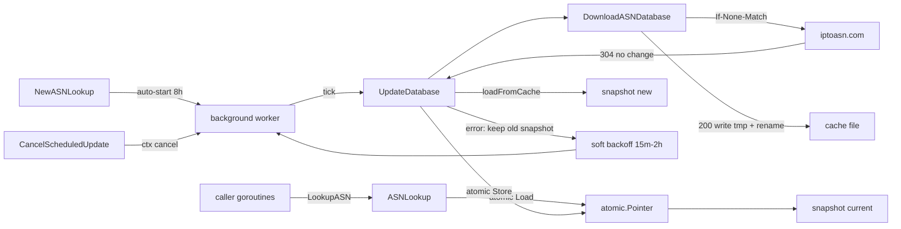

# Requirements

### Overview & Goals

Today all download, caching and parsing logic lives inside `NewASNDatabaseWithCache` in `pkg/asnlookup/cache.go`. A process that runs for days keeps whatever it parsed at startup forever, and the only way to get fresher data is to delete `/tmp/asnlookup.cache` and restart.

Goals:

- Split downloading/refreshing the on-disk cache out of the constructor into a standalone, callable operation.
- Let a long-running process refresh its in-memory database at runtime, seamlessly, without blocking or breaking in-flight lookups.
- **Make periodic refresh the default**: a process that builds an `ASNLookup` gets an automatic ETag-conditional freshness check every **8 hours**, with no extra call required.
- **Fail open**: a failed check never breaks lookups and never takes the process down — the current snapshot keeps serving and the worker retries with a soft, capped backoff.
- Add a background worker to the interface: `ScheduleUpdateDatabase(time.Duration)` and `CancelScheduledUpdate()` for callers who want a different cadence or an explicit shutdown.
- Avoid re-downloading ~9 MB when the upstream file has not changed (verified: `iptoasn.com` returns `ETag`/`Last-Modified` and answers `If-None-Match` with `304`; it also advertises `Cache-Control: max-age=14400`, so an 8 h cadence is comfortably polite).

### Scope

**In scope**

- New `DownloadASNDatabase` / `UpdateASNDatabase` functions handling HTTP fetch, conditional requests and atomic cache-file replacement.
- A new concurrency-safe holder type that owns the current database snapshot and swaps it atomically.
- Auto-refresh on by default in `NewASNLookup` (8 h `DefaultUpdateInterval`, jittered), with `WithUpdateInterval` / `WithAutoUpdate(false)` to tune or disable.
- Fail-open error policy: soft capped backoff retries, last-error bookkeeping, no panics, no fatal errors from the worker.
- `ScheduleUpdateDatabase(time.Duration)` / `CancelScheduledUpdate()` on `ASNDatabaseInterface`, backed by a background goroutine.
- Update `cmd/main.go` to use the new API, plus tests and README notes.

**Out of scope**

- Changing the on-disk cache format (still the gzipped TSV as downloaded).
- Changing the lookup algorithms in `LookupASN` / `GetPrefixesByASN`.
- Alternative data sources or a persisted binary index.
- Auto-refresh from the legacy `NewASNDatabase()` / `NewASNDatabaseWithCache()` constructors — they stay goroutine-free and behave exactly as today.

### User Stories

- As a service author, I want `NewASNLookup(path)` to keep my ASN data fresh automatically, so I do not have to remember to schedule anything.
- As a service author, I want a transient network outage to be a non-event: lookups keep working on the previous snapshot and the library quietly retries later.
- As a service author, I want to override the 8 h cadence via `ScheduleUpdateDatabase(d)` or turn auto-refresh off entirely when I manage refreshes myself.
- As a service author, I want lookups happening on other goroutines to keep working — and never see a half-loaded database — while an update is being applied.
- As a service author, I want `CancelScheduledUpdate()` to stop the worker cleanly on shutdown, with no goroutine leak.
- As a CLI user, I want to force a refresh of the cache file without manually deleting it.
- As an operator, I want an unchanged upstream file to cost one cheap `304` request rather than a full download and re-parse.

### Functional Requirements

1. `DownloadASNDatabase(cacheFile)` downloads the database to `cacheFile` and reports whether the content actually changed.
2. Conditional fetch: if cache metadata holds an `ETag`/`Last-Modified` for the existing cache file, the request sends `If-None-Match`/`If-Modified-Since`; a `304` means "no change" and no re-write, no re-parse.
3. The cache file is never left half-written: download to a temp file in the same directory, then `os.Rename` over the target.
4. `UpdateASNDatabase(cacheFile)` = conditional download + parse, returning a fresh `*ASNDatabase`.
5. Lookups during an update always observe either the complete old snapshot or the complete new one.
6. `NewASNLookup` starts the background refresh worker by default at `DefaultUpdateInterval = 8 * time.Hour`; `WithUpdateInterval(d)` changes it and `WithAutoUpdate(false)` disables it.
7. Each tick is a conditional ETag/`Last-Modified` check; a `304` costs one small request and touches neither disk nor memory.
8. `ScheduleUpdateDatabase(d)` starts/replaces the worker ticking every `d`; calling it again cancels the previous schedule first. `d <= 0` is an error.
9. `CancelScheduledUpdate()` stops the worker and waits for it to exit; it is safe to call when nothing is scheduled and safe to call twice.
10. **Fail open**: a failed update (network error, non-2xx, bad gzip, unwritable cache) never returns a fatal error from the worker, never replaces the snapshot, and never stops the schedule — lookups continue on the existing data.
11. **Soft retry**: after a failure the worker retries on a gentle capped backoff (15 min → 30 → 60 → 120, capped at 2 h, never below 15 min) and returns to the normal 8 h cadence after the first success.
12. Ticks carry a small random jitter (±10 %) so many instances do not hit the endpoint in lockstep.
13. Failures are observable without being intrusive: `OnError` callback plus `LastUpdate()` / `LastError()` accessors.
14. If the initial load cannot download, `NewASNLookup` falls back to an existing (even stale) cache file rather than failing; it only errors when there is no usable data at all.
15. Existing behaviour is preserved: `NewASNDatabase()` / `NewASNDatabaseWithCache(path)` still return a usable `*ASNDatabase` with no background goroutines, and `IPv4Entries` / `IPv6Entries` remain exported fields.

### Non-Functional Requirements

- Standard library only — `go.mod` stays dependency-free (Go 1.25).
- Reads stay lock-free: one `atomic.Pointer` load per lookup, no measurable regression in the `--timing` benchmark.
- All new code must be clean under `go test -race`.
- Peak memory during a refresh is roughly two snapshots; this is accepted and documented.
- Politeness to `iptoasn.com`: at most one conditional request per 8 h per process in steady state, never a tighter retry loop than 15 minutes, and a bounded HTTP client timeout.
- No unexpected goroutines from the legacy constructors; the auto-refresh worker exists only for `ASNLookup` and is stoppable.

# Technical Design

### Current Implementation

- `pkg/asnlookup/cache.go`
  - `ASNDatabase` — `IPv4Entries` / `IPv6Entries` (sorted `[]ASNEntry`), plus unexported `asnIndex` and `indexOnce`.
  - `ASNDatabaseInterface` — only `LookupASN(net.IP) ASNEntryInterface`.
  - `NewASNDatabaseWithCache(cacheFile)` — `os.Stat`; if the file exists it just parses it (however stale), otherwise `http.Get(ASN_DATABASE_URL)`, `os.Create`, `io.Copy`, then `loadFromCache`.
  - `loadFromCache(filename)` — gunzip, scan TSV, split v4/v6, sort both slices, then `db.indexOnce.Do(db.buildASNIndex)`.
- `pkg/asnlookup/prefixes.go` — `buildASNIndex` / `GetPrefixesByASN`, indices into the sorted slices.
- `cmd/main.go` — builds a `*asnlookup.ASNDatabase` at line 26 and reads the exported slices directly in `asnMetadata` (line 140) and `collectASNs` (line 215).

Problems: the constructor conflates "fetch" with "parse"; an existing cache file is never refreshed; nothing can replace the data at runtime; mutating the slices in place would corrupt the `sort.Search` in `LookupASN` and the `int32` indices in `asnIndex`.

### Key Decisions

1. **Immutable snapshot + atomic swap.** `ASNDatabase` is treated as an immutable value: once `loadFromCache` has sorted the slices and built `asnIndex`, it is never mutated. Refreshing means building a *new* `*ASNDatabase` and swapping a pointer. This is required by the binary search and the index — the whole database has to be replaced as one unit.
2. **Keep `ASNDatabase` as-is; add a holder.** Per your "keep fields, add only" choice, `IPv4Entries`/`IPv6Entries` stay exported fields on the snapshot. The atomic pointer lives in a **new** type, `ASNLookup`, which is what long-running callers hold.
3. **Conditional HTTP with a metadata sidecar.** Store the upstream `ETag`/`Last-Modified` next to the cache as `<cacheFile>.meta` (small JSON). Verified against the live endpoint: `If-None-Match` yields `304`, so an unchanged database costs one small request.
4. **Atomic file replacement.** Write to `<cacheFile>.tmp-*` in the same directory and `os.Rename` — a crash mid-download can never leave a truncated cache that later parses into a half-empty database.
5. **Interface split.** `ASNDatabaseInterface` gains the update methods as requested; a smaller `ASNLookuper` interface (`LookupASN` + `GetPrefixesByASN`) keeps `*ASNDatabase` usable on its own and is embedded by `ASNDatabaseInterface`.
6. **Errors are reported, never fatal (fail open).** The worker forwards failures to an optional `OnError` callback, records `lastError`, keeps serving the existing snapshot and keeps running; `LastUpdate`/`LastError` are available for polling.
7. **Auto-refresh is the default, 8 h, jittered.** `NewASNLookup` calls the scheduler itself with `DefaultUpdateInterval = 8 * time.Hour`. Rationale: the whole point of the holder is a long-running process, and an ETag-conditional check is cheap (a `304` with no body). Jitter of ±10 % avoids synchronised herds. Opt out with `WithAutoUpdate(false)`.
8. **Soft, capped backoff instead of aggressive retry.** Failure schedule is 15 min → 30 min → 1 h → 2 h (cap), reset on success. This is deliberately slower than a typical exponential-from-1s policy — the data is valid for hours, so there is no reason to hammer the origin.
9. **Non-blocking startup.** The constructor parses whatever cache is on disk; if a `WithMaxCacheAge` threshold says it is stale, the conditional refresh happens in the background worker's immediate first tick rather than blocking the caller.

### Proposed Changes

**New file `pkg/asnlookup/download.go`**

- `cacheMeta` struct + `readMeta` / `writeMeta` for `<cacheFile>.meta`.
- `DownloadASNDatabase(cacheFile string) (bool, error)` — thin wrapper over the client-aware form; returns `changed`.
- Conditional request logic: set `If-None-Match` / `If-Modified-Since` when the cache file *and* its metadata exist; `304` → `(false, nil)`; `200` → temp file, `io.Copy`, `Sync`, `Rename`, persist new metadata, `(true, nil)`; any other status → error.
- `UpdateASNDatabase(cacheFile string) (*ASNDatabase, error)` — download then `loadFromCache`.
- `NewASNDatabaseWithCache` is rewritten on top of these helpers, preserving its "use the cache file if present, otherwise download" semantics.

**New file `pkg/asnlookup/updater.go`**

- `ASNLookup` holder: cache path, `atomic.Pointer[ASNDatabase]`, `*http.Client`, mutex-guarded scheduler state (`context.CancelFunc`, `sync.WaitGroup`), `OnUpdate`/`OnError` callbacks, `lastUpdate`/`lastError`.
- `NewASNLookup(cacheFile string, opts ...Option) (*ASNLookup, error)` — loads the initial snapshot (downloading if absent) and stores it.
- Read path delegates to the loaded snapshot; `Database()` exposes the current snapshot so callers can still touch `IPv4Entries`/`IPv6Entries`.
- `UpdateDatabase() (bool, error)` — conditional download; on `changed` parse and `snapshot.Store(newDB)`; on `304` return `(false, nil)` without touching memory. A mutex serialises concurrent updaters so two goroutines never download at once.
- `ScheduleUpdateDatabase(d)` / `CancelScheduledUpdate()` — `context`-driven timer goroutine (a re-armed `time.Timer`, not a fixed `Ticker`, because the backoff changes the next delay); re-scheduling cancels the previous worker first.
- `nextDelay()` helper: normal interval with ±10 % jitter on success, backoff ladder (15 m / 30 m / 1 h / 2 h cap) after failure, reset on the next success.
- Auto-start: `NewASNLookup` invokes `ScheduleUpdateDatabase(DefaultUpdateInterval)` unless `WithAutoUpdate(false)` was passed; a failure to start is impossible for a valid constant interval.

**`pkg/asnlookup/cache.go`**

- Add `ASNLookuper`; redefine `ASNDatabaseInterface` to embed it and add `UpdateDatabase`, `ScheduleUpdateDatabase`, `CancelScheduledUpdate`.
- Extract the download body out of `NewASNDatabaseWithCache`; entry structs and `loadFromCache` are otherwise untouched.

**`cmd/main.go`**

- Use `asnlookup.NewASNLookup(*cacheFile, asnlookup.WithAutoUpdate(false))` for one-shot lookups — a CLI that exits immediately has no use for a background worker; obtain `db := lookup.Database()` for the existing field-reading helpers.
- Add `-force-update` (calls `UpdateDatabase()` before serving) and `-update-interval` (long-running `--timing` mode enables the scheduler with `defer lookup.CancelScheduledUpdate()`, defaulting to the 8 h constant).

### Data Models / Contracts

```go
// cache.go
type ASNLookuper interface {
    LookupASN(ip net.IP) ASNEntryInterface
    GetPrefixesByASN(asn int) []netip.Prefix
}

type ASNDatabaseInterface interface {
    ASNLookuper
    UpdateDatabase() (changed bool, err error)
    ScheduleUpdateDatabase(interval time.Duration) error
    CancelScheduledUpdate()
}

// Refresh policy defaults (updater.go)
const (
    DefaultUpdateInterval = 8 * time.Hour  // ETag-conditional freshness check
    minRetryInterval      = 15 * time.Minute
    maxRetryInterval      = 2 * time.Hour
    updateJitterFraction  = 0.10
)

// download.go
func DownloadASNDatabase(cacheFile string) (changed bool, err error)
func UpdateASNDatabase(cacheFile string) (*ASNDatabase, error)

type cacheMeta struct {
    ETag         string    `json:"etag,omitempty"`
    LastModified string    `json:"last_modified,omitempty"`
    FetchedAt    time.Time `json:"fetched_at"`
}

// updater.go
type ASNLookup struct {
    cacheFile string
    snapshot  atomic.Pointer[ASNDatabase]
    client    *http.Client

    updateMu sync.Mutex // serialises UpdateDatabase

    schedMu sync.Mutex
    cancel  context.CancelFunc
    wg      sync.WaitGroup

    autoUpdate bool          // default true
    interval   time.Duration // default DefaultUpdateInterval (8h)
    failures   int           // drives the soft backoff ladder

    OnUpdate func(*ASNDatabase)
    OnError  func(error)
}

func NewASNLookup(cacheFile string, opts ...Option) (*ASNLookup, error)
func (l *ASNLookup) Database() *ASNDatabase
func (l *ASNLookup) LookupASN(ip net.IP) ASNEntryInterface
func (l *ASNLookup) GetPrefixesByASN(asn int) []netip.Prefix
func (l *ASNLookup) UpdateDatabase() (bool, error)
func (l *ASNLookup) ScheduleUpdateDatabase(interval time.Duration) error
func (l *ASNLookup) CancelScheduledUpdate()
func (l *ASNLookup) LastUpdate() time.Time
func (l *ASNLookup) LastError() error

// nextDelay returns the wait before the next check: jittered interval after a
// success, or the soft capped backoff ladder after consecutive failures.
func (l *ASNLookup) nextDelay() time.Duration
```

Options: `WithAutoUpdate(bool)` (default `true`), `WithUpdateInterval(time.Duration)` (default 8 h), `WithHTTPClient(*http.Client)`, `WithURL(string)` (test seam for `httptest`), `WithOnUpdate(func(*ASNDatabase))`, `WithOnError(func(error))`, `WithMaxCacheAge(time.Duration)`.

### File Structure

```
pkg/asnlookup/
  cache.go          (modified) interfaces + constructors delegate to download.go
  download.go       (new)      conditional HTTP fetch, meta sidecar, atomic rename
  updater.go        (new)      ASNLookup holder, atomic swap, background worker
  download_test.go  (new)      httptest: 200/304/error, temp-file atomicity
  updater_test.go   (new)      swap-under-load, schedule/cancel, no goroutine leak
  cache_test.go     (unchanged) existing loadFromCache/LookupASN coverage
cmd/main.go         (modified) uses ASNLookup, -force-update, -update-interval
README.md           (modified) document the refresh API
```

### Architecture Diagram



### Risks

- **Double memory during refresh** — old and new snapshots coexist briefly; the old one is GC'd once the last in-flight lookup releases it. Documented, acceptable for a ~150 MB-of-entries dataset.
- **Stale entry pointers** — `LookupASN` returns `*ASNEntry` into a snapshot; after a swap that pointer still references the old (immutable, still valid) data. Safe, but worth a doc comment.
- **Direct field access on a stale snapshot** — callers that cached `db.IPv4Entries` see the old data after a swap; `Database()` must be called per operation. Documented.
- **Servers without ETag** — fall back to `Last-Modified`, and to an unconditional download if neither is present.
- **Overlapping updates** — prevented by `updateMu`; a tick arriving while an update is still running is skipped rather than queued.
- **Surprise goroutine from a default-on worker** — mitigated by keeping the legacy constructors worker-free, documenting `CancelScheduledUpdate()` as the shutdown hook, and offering `WithAutoUpdate(false)`; short-lived CLI runs use that option.
- **Tests that must not hit the network** — every test passes `WithURL(httptest)` and either `WithAutoUpdate(false)` or a millisecond interval, so the 8 h default never causes real traffic.
- **Persistent upstream failure** — bounded by the 2 h backoff cap: the process keeps serving stale-but-valid data indefinitely and logs via `OnError` rather than degrading.

# Testing

### Validation Approach

All new behaviour is testable with the standard library: `net/http/httptest` for the upstream, `t.TempDir()` for cache files (mirroring the existing `cache_test.go` style), and `go test -race ./...` for the concurrency claims. No test touches the real `iptoasn.com`.

### Key Scenarios

- `DownloadASNDatabase` against a fresh temp dir: file is created, gunzips correctly, `changed == true`, and `<cacheFile>.meta` holds the server's ETag.
- Second call against the same server: request carries `If-None-Match`, server replies `304`, `changed == false`, cache file mtime and contents unchanged.
- Server returns new content with a new ETag: `changed == true` and the file is replaced.
- `UpdateASNDatabase` returns a parsed `*ASNDatabase` whose entry counts match the served fixture.
- `ASNLookup.UpdateDatabase()` swaps the snapshot: `LookupASN` for an IP present only in the second fixture returns `nil` before and the right ASN after.
- `ScheduleUpdateDatabase(50 * time.Millisecond)` triggers repeated updates (counted via the test server's handler and `OnUpdate`); `CancelScheduledUpdate()` stops further hits.
- `NewASNLookup` with defaults reports `autoUpdate == true` and a scheduled worker; with `WithAutoUpdate(false)` no goroutine is started and the request count on the test server stays at the initial load.
- `nextDelay()` unit table: success → interval ±10 %; 1–5 consecutive failures → 15 m, 30 m, 1 h, 2 h, 2 h; success resets to the jittered interval.
- Concurrent lookups: N goroutines hammer `LookupASN`/`GetPrefixesByASN` while updates swap snapshots; every result is a valid entry from *some* snapshot and `-race` is clean.
- `cmd/main.go` still works end to end: `go build ./...`, `go vet ./...`, and a lookup run against a pre-seeded cache file.

### Edge Cases

- HTTP 500 / connection refused during a scheduled update → old snapshot still serves lookups, `OnError` fires, `LastError` is set, the worker stays alive and reschedules (fail open).
- Repeated failures → backoff grows and caps at 2 h; lookups never return an error because of it.
- Download fails at construction but a stale cache file exists → `NewASNLookup` succeeds on the stale data and the worker retries in the background.
- Server returns garbage that fails gzip parsing → the in-memory snapshot is not replaced.
- `ScheduleUpdateDatabase(0)` and negative durations → error, no goroutine started.
- `CancelScheduledUpdate()` with nothing scheduled, and called twice → no panic.
- `ScheduleUpdateDatabase` called twice → only one worker remains active.
- Unwritable cache directory → clear error, temp file cleaned up, no partial cache file left behind.
- Existing cache file with no `.meta` sidecar → unconditional download, metadata written afterwards.
- Goroutine-leak check: goroutine count returns to baseline after `CancelScheduledUpdate()`.

### Test Changes

- Add `pkg/asnlookup/download_test.go` and `pkg/asnlookup/updater_test.go`.
- Reuse the gzipped-TSV fixture helper pattern from `cache_test.go` (extract it into a small shared test helper).
- `cache_test.go` and `prefixes_test.go` stay green unchanged — that is the backwards-compatibility check.

# Delivery Steps

### ✓ Step 1: Extract conditional download into DownloadASNDatabase
The cache file can be fetched and refreshed by a standalone function that skips the download when upstream is unchanged.

- Create `pkg/asnlookup/download.go` with `DownloadASNDatabase(cacheFile string) (changed bool, err error)` and `UpdateASNDatabase(cacheFile string) (*ASNDatabase, error)`.
- Add a `cacheMeta` sidecar (`<cacheFile>.meta`, JSON with `etag`, `last_modified`, `fetched_at`) plus `readMeta`/`writeMeta`.
- Build the request with `If-None-Match`/`If-Modified-Since` when cache file and metadata both exist; treat `304` as `changed == false`, `200` as a fresh copy, anything else as an error (verified: the live endpoint returns an ETag and answers `304`).
- Download into `<cacheFile>.tmp-*` in the same directory, `Sync`, then `os.Rename` so the cache is never partially written; clean up the temp file on failure.
- Rewrite `NewASNDatabaseWithCache` in `pkg/asnlookup/cache.go` to delegate to these helpers while keeping its current semantics and signature.
- Add `download_test.go` covering first download, `304` no-op, changed-ETag replacement, HTTP error, and unwritable directory, all via `httptest`.

### ✓ Step 2: Add ASNLookup holder with atomic snapshot swap
A long-running caller can refresh the database at runtime while concurrent lookups keep serving without blocking.

- Create `pkg/asnlookup/updater.go` with the `ASNLookup` type holding `cacheFile`, `atomic.Pointer[ASNDatabase]`, an `*http.Client` and `updateMu`.
- Add `NewASNLookup(cacheFile string, opts ...Option)` plus options `WithHTTPClient`, `WithURL`, `WithOnUpdate`, `WithOnError`, `WithMaxCacheAge`.
- Implement `Database()`, `LookupASN`, `GetPrefixesByASN` as loads of the current snapshot, and `UpdateDatabase() (bool, error)` which conditionally downloads, parses and `Store`s a brand-new `*ASNDatabase` — the whole database is replaced as one unit because `sort.Search` and the `asnIndex` int32 offsets depend on the slices staying immutable.
- Serialise concurrent updates with `updateMu`; leave the existing snapshot untouched when a download or parse fails.
- In `cache.go`, add the `ASNLookuper` interface (`LookupASN` + `GetPrefixesByASN`, satisfied by `*ASNDatabase`) and extend `ASNDatabaseInterface` to embed it plus the update methods; keep `IPv4Entries`/`IPv6Entries` as exported fields.
- Add tests that swap between two fixtures and verify lookups reflect the new data, plus a `-race` test hammering lookups during repeated swaps.

### ✓ Step 3: Add the fail-open background scheduler with soft backoff
`ScheduleUpdateDatabase` keeps the database fresh on a timer, failures never propagate, and `CancelScheduledUpdate` shuts the worker down cleanly.

- Implement `ScheduleUpdateDatabase(interval time.Duration) error` in `updater.go`: reject `interval <= 0`, cancel any existing worker, then start a `context`-driven goroutine tracked by a `sync.WaitGroup`.
- Use a re-armed `time.Timer` instead of a fixed `Ticker` so the delay can vary, and add `nextDelay()`: jittered `interval` (±10 %) after a success, and the soft ladder `15m → 30m → 1h → 2h` (cap) after consecutive failures, reset on the next success.
- Each tick calls `UpdateDatabase()`; skip the tick if an update is already in flight, and invoke `OnUpdate` only when the snapshot actually changed (a `304` is a silent no-op).
- Fail open on error: record `lastError`, invoke `OnError`, keep the current snapshot, keep the worker running, and just take the longer backoff delay — never return a fatal error or stop the schedule.
- Implement `CancelScheduledUpdate()` to cancel the context and wait for the worker to exit; make it safe to call when nothing is scheduled and safe to call repeatedly.
- Expose `LastUpdate() time.Time` and `LastError() error` for callers that prefer polling over callbacks.
- Add `updater_test.go` cases: short-interval scheduling fires repeatedly, cancel stops further requests, re-scheduling leaves one worker, invalid interval errors, a failing server preserves the old snapshot and keeps the worker alive, a `nextDelay()` table test for jitter and the backoff ladder, and goroutine count returning to baseline after cancel.

### ✓ Step 4: Turn auto-refresh on by default and wire the CLI + docs
`NewASNLookup` refreshes every 8 hours out of the box, and the CLI opts out because it exits immediately.

- Add `DefaultUpdateInterval = 8 * time.Hour` plus the `minRetryInterval` / `maxRetryInterval` / jitter constants to `updater.go`.
- Make `NewASNLookup` auto-start the worker at `DefaultUpdateInterval` unless `WithAutoUpdate(false)` is given; add `WithUpdateInterval(d)` for a custom cadence.
- Make the constructor fail-open at startup too: if the conditional download fails but a cache file exists, parse the stale cache and let the worker retry, erroring only when there is no usable data.
- Update `cmd/main.go` to construct the holder with `WithAutoUpdate(false)` for one-shot lookups and pass `lookup.Database()` into `printASNPrefixes`, `asnMetadata`, `collectASNs` and the timing benchmarks, which keep reading the exported entry slices.
- Add a `-force-update` flag that calls `UpdateDatabase()` before serving and reports whether the database changed, and an `-update-interval` flag that enables the scheduler (defaulting to the 8 h constant) with `defer lookup.CancelScheduledUpdate()` for the long-running `--timing` mode.
- Update `README.md` with the default refresh policy (8 h ETag-conditional, jittered, fail open with 15 m–2 h backoff), how to change or disable it, the immutable-snapshot semantics (call `Database()` per operation; entries from a previous snapshot stay valid), the shutdown hook and the transient double-memory cost.
- Verify with `go build ./...`, `go vet ./...` and `go test -race ./...`, confirming `cache_test.go` and `prefixes_test.go` pass unchanged.