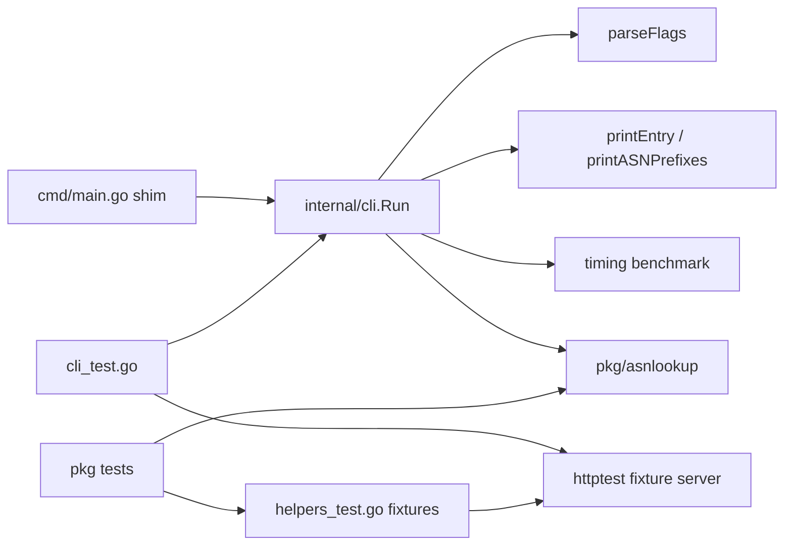

# Requirements

### Overview & Goals

The repository already ships a substantial suite (`cache_test.go`, `download_test.go`, `prefixes_test.go`, `updater_test.go` — ~1700 lines). The goal is to turn it into a *complete* suite: close the remaining coverage gaps, make the CLI testable, add fuzzing and runnable documentation examples, and have CI report coverage.

### Scope

**In scope**

- Gap-filling unit tests for every exported and unexported function in `pkg/asnlookup`.
- Consolidation of duplicated test fixtures into a single `helpers_test.go`.
- Fuzz targets for `rangeToPrefixes` and the gzip/TSV cache parser.
- Runnable `Example*` functions that double as godoc.
- Extraction of `cmd/main.go` logic into a new `internal/cli` package plus black-box-style tests of the CLI behaviour.
- Update of `.github/workflows/run-tests.yml`: Go version aligned with `go.mod` (1.25) and `-coverprofile` with a printed summary.

**Out of scope**

- Any behavioural change to the library API.
- Tests that hit the real `https://iptoasn.com` endpoint (network-dependent paths stay exercised through `httptest`).
- A hard coverage threshold gate in CI (reporting only, per your choice).

### Functional Requirements

1. `go test -race ./...` passes with no network access and no reliance on `/tmp/asnlookup.cache`.
2. Every file in `pkg/asnlookup` has direct tests for its exported surface, plus its non-trivial unexported helpers (`calculatePrefixLength`, `readMeta`/`writeMeta`, `writeCacheFile`, `trailingZeroBits`, `lastAddr`, `nextAddr`, `jitter`, `nextDelay`, `cacheUsable`).
3. The CLI's flag handling, csv/json rendering, error messages and exit codes are asserted by tests.
4. `go test -run=Fuzz -fuzz=... -fuzztime=10s` runs clean on both fuzz targets; committed seed corpora keep them useful in normal `go test` runs.
5. CI publishes a per-package coverage summary on every push and PR.

### Non-Functional Requirements

- Whole suite stays fast: no test may sleep longer than needed; time-driven updater tests keep using small intervals as they do today.
- No global state or fixed paths — every test uses `t.TempDir()`.
- CLI exit codes follow Unix convention: `0` success, `1` runtime error (download/lookup failure, no result), `2` usage/flag error (matching Go's `flag` package).

# Technical Design

### Current Implementation

| File | Covered today | Gaps found |
|---|---|---|
| `pkg/asnlookup/cache.go` | `loadFromCache` (v4/v6/mixed/malformed), `LookupASN` v4+v6, `GetIPNet`, accessor methods | `calculatePrefixLength` not tested directly; `LookupASN` with a malformed `net.IP` (the `return nil` fall-through), empty DB, address in a gap between ranges; `NewASNDatabase()`/`NewASNDatabaseWithCache` download path; `bufio.Scanner` 64 KiB line limit; truncated gzip stream mid-read |
| `pkg/asnlookup/download.go` | `downloadASNDatabase` (first/304/changed ETag/500/unwritable dir/no sidecar) | `readMeta` with corrupt JSON and with an empty ETag+Last-Modified pair; `writeMeta`; `If-Modified-Since` sent when only `Last-Modified` is known; validators suppressed when the cache file is gone but the sidecar remains; `writeCacheFile` with a reader that fails mid-stream; `UpdateASNDatabase`; `defaultHTTPClient` timeout |
| `pkg/asnlookup/prefixes.go` | `rangeToPrefixes` table, invalid addr, exact coverage, `GetPrefixesByASN` v4/v6/mixed/not-found/deterministic/lazy index | Mismatched address families; full address-space range `0.0.0.0-255.255.255.255` exercising the `nextAddr` wrap-around break; `GetPrefixesByASN` on a nil `*ASNDatabase`; concurrent first call racing on `indexOnce` |
| `pkg/asnlookup/updater.go` | constructor paths, snapshot swap, scheduling, fail-open, `nextDelay`, concurrency | `Option` no-op guards (`WithHTTPClient(nil)`, `WithURL("")`, `WithUpdateInterval(0)`); `WithMaxCacheAge` stale-cache refresh and `cacheUsable`; `WithOnUpdate`/`WithOnError` callbacks; `LookupASN`/`GetPrefixesByASN` on a zero-value holder (nil snapshot); `jitter` bounds; `LastUpdate`/`LastError` transitions |
| `cmd/main.go` | nothing | entire file |

`go.mod` declares `go 1.25`; the workflow pins `1.21` and runs `go test -v -race ./...` with no coverage.

### Key Decisions

1. **CLI logic moves to `internal/cli`** (your choice). `cmd/main.go` becomes a shim; `cli.Run(args []string, stdout, stderr io.Writer) int` is unit-testable in-process with no subprocess spawning.
2. **One `helpers_test.go`** holds the gzip fixture builders and `fixtureServer`, replacing `writeCacheFixture` (download_test.go:40) and `writeTestCache` (prefixes_test.go:13); existing tests are updated to call the shared versions.
3. **Fuzzing over property libraries** — standard-library `testing.F`, no new dependencies (the module currently has zero).
4. **No network in tests** — the CLI must accept an injectable URL so tests can point it at an `httptest` server; a hidden/undocumented `-database-url` flag (or a `cli.Options` struct field) provides this.
5. **Exit codes**: `0` / `1` / `2` as described in Requirements; existing message wording is preserved so the change is not user-visible beyond the usage-error code.

### Proposed Changes

**New package `internal/cli`**

```go
package cli

// Run parses args (without the program name), executes the requested
// operation and returns the process exit code. All output goes to the
// supplied writers; Run never calls os.Exit.
func Run(args []string, stdout, stderr io.Writer) int

type config struct {
    cacheFile      string
    format         string
    asn            int
    ip             string
    timing         bool
    forceUpdate    bool
    updateInterval time.Duration
    databaseURL    string        // test seam, defaults to asnlookup.ASN_DATABASE_URL
    benchDuration  time.Duration // test seam, defaults to 5s
}

func parseFlags(args []string, stderr io.Writer) (config, error)
func printEntry(w io.Writer, entry asnlookup.ASNEntryInterface, format string) error
func printASNPrefixes(w io.Writer, db *asnlookup.ASNDatabase, asn int, format string) error
```

`asnMetadata`, `collectASNs`, `runTimingBenchmark` and the printers move over unchanged apart from taking an `io.Writer`. `cmd/main.go` shrinks to:

```go
func main() { os.Exit(cli.Run(os.Args[1:], os.Stdout, os.Stderr)) }
```

**Test files**

- `pkg/asnlookup/helpers_test.go` — `gzipFixture`, `writeCacheFixture`, `writeTestCache`, `fixtureServer` and its methods, `mustAddr`, `prefixStrings`, `assertPrefixes`, plus a new `newTestDB(t, tsv)` shortcut.
- `pkg/asnlookup/cache_test.go` — extended with `TestCalculatePrefixLength` (single IP, /24, non-power-of-two range, IPv6), `TestLookupASN_EmptyDatabase`, `TestLookupASN_GapBetweenRanges`, `TestLookupASN_InvalidIP`, `TestLoadFromCache_TruncatedGzip`, `TestLoadFromCache_OverlongLine`, `TestNewASNDatabaseWithCache_DownloadsWhenMissing` (via injected fixture cache).
- `pkg/asnlookup/download_test.go` — extended with `TestReadMeta_*`, `TestWriteMeta_*`, `TestDownloadASNDatabase_IfModifiedSinceOnly`, `TestDownloadASNDatabase_MissingCacheSkipsValidators`, `TestWriteCacheFile_ReaderError`, `TestUpdateASNDatabase_*`.
- `pkg/asnlookup/prefixes_test.go` — extended with family-mismatch, full-space, nil-DB and concurrent-index cases.
- `pkg/asnlookup/prefixes_fuzz_test.go` — `FuzzRangeToPrefixes` (seeded with the existing table cases) asserting: prefixes are contiguous, cover exactly `start..end`, are minimal, and never panic.
- `pkg/asnlookup/cache_fuzz_test.go` — `FuzzLoadFromCache` feeding arbitrary bytes through gzip into `loadFromCache`, asserting no panic and that returned slices stay sorted.
- `pkg/asnlookup/example_test.go` — `ExampleNewASNLookup`, `ExampleASNDatabase_LookupASN`, `ExampleASNDatabase_GetPrefixesByASN` built on a local fixture cache so output is deterministic.
- `pkg/asnlookup/updater_test.go` — extended with the option-guard, max-cache-age, callback, nil-snapshot and `jitter` cases.
- `internal/cli/cli_test.go` — table-driven tests over `Run` asserting stdout, stderr and exit codes.

**CI** — `.github/workflows/run-tests.yml`: `go-version: '1.25'` (or `go-version-file: go.mod`), test step becomes `go test -v -race -coverprofile=coverage.out -covermode=atomic ./...` followed by `go tool cover -func=coverage.out | tail -1`, plus a short `go test -run=Fuzz -fuzz=FuzzRangeToPrefixes -fuzztime=30s ./pkg/asnlookup` step.

### File Structure

```
cmd/main.go                                (modified — reduced to a shim)
internal/cli/cli.go                        (new — Run, parseFlags, config)
internal/cli/output.go                     (new — printEntry, printASNPrefixes, asnMetadata)
internal/cli/benchmark.go                  (new — timing mode, injectable duration)
internal/cli/cli_test.go                   (new)
internal/cli/output_test.go                (new)
pkg/asnlookup/helpers_test.go              (new — shared fixtures)
pkg/asnlookup/cache_test.go                (modified)
pkg/asnlookup/cache_fuzz_test.go           (new)
pkg/asnlookup/download_test.go             (modified)
pkg/asnlookup/prefixes_test.go             (modified)
pkg/asnlookup/prefixes_fuzz_test.go        (new)
pkg/asnlookup/updater_test.go              (modified)
pkg/asnlookup/example_test.go              (new)
.github/workflows/run-tests.yml            (modified)
```

### Architecture Diagram



### Risks

- **Moving CLI code** risks behavioural drift; mitigated by porting functions verbatim and asserting the current message wording in the new tests.
- **Fuzz targets can be slow or flaky in CI**; mitigated with a bounded `-fuzztime` and committed seed corpora under `testdata/fuzz`.
- **`Example` output must be byte-stable**; achieved by building the database from a fixed in-test fixture rather than a downloaded cache.
- **`go.mod` says 1.25 while CI pins 1.21** — bumping CI could surface new vet/test failures; the version bump is done in the same stage as the coverage change so any fallout is visible immediately.

# Testing

### Validation Approach

- Run `go test -race ./...` after each stage; the suite must stay green and network-free.
- Track progress with `go test -coverprofile=coverage.out ./... && go tool cover -func=coverage.out`, aiming for near-complete statement coverage of `pkg/asnlookup` and `internal/cli`.
- Smoke the fuzz targets locally with `-fuzztime=30s` before committing the seed corpora.

### Key Scenarios

- Parsing a gzipped TSV cache yields correctly split, normalised and sorted IPv4/IPv6 entry slices.
- `LookupASN` resolves addresses inside ranges, returns `nil` for gaps, empty databases and malformed `net.IP` values.
- A conditional download returns `changed=false` on 304 and leaves the cache file byte-identical.
- `UpdateDatabase` swaps the snapshot atomically; entries obtained before the swap remain valid.
- `cli.Run` prints the expected csv and json for an IP lookup and for `--asn`, and returns the documented exit code for each failure mode.

### Edge Cases

- Corrupt or empty metadata sidecar, cache file deleted while the sidecar survives.
- `writeCacheFile` aborting mid-stream leaves no temporary file behind.
- `rangeToPrefixes` on the full IPv4/IPv6 address space (wrap-around) and on mismatched families.
- Concurrent first calls to `GetPrefixesByASN` (`indexOnce` race, verified under `-race`).
- Zero-value `ASNLookup` (nil snapshot) returns `nil` / an empty slice rather than panicking.
- `ScheduleUpdateDatabase` with a non-positive interval; repeated scheduling leaves exactly one worker.

### Test Changes

- Existing helpers `writeCacheFixture` and `writeTestCache` are replaced by shared versions in `helpers_test.go`; all current call sites are updated.
- No existing assertions are weakened or removed.

# Delivery Steps

### ✓ Step 1: Consolidate test fixtures and close cache.go gaps
All shared test fixtures live in one place and `cache.go` is fully covered.

- Create `pkg/asnlookup/helpers_test.go` holding `gzipFixture`, `writeCacheFixture`, `writeTestCache`, `mustAddr`, `prefixStrings`, `assertPrefixes`, the `fixtureServer` type and a new `newTestDB(t, tsv)` shortcut.
- Remove the duplicated helpers from `download_test.go` and `prefixes_test.go` and repoint their call sites.
- Add `TestCalculatePrefixLength` covering a single IP, an exact /24, a non-power-of-two range and an IPv6 range.
- Add `TestLookupASN_EmptyDatabase`, `TestLookupASN_GapBetweenRanges`, `TestLookupASN_BelowFirstEntry` and `TestLookupASN_InvalidIP` (malformed 3-byte `net.IP`).
- Add `TestLoadFromCache_TruncatedGzip`, `TestLoadFromCache_EmptyFile` and `TestLoadFromCache_OverlongLine` (exceeding the `bufio.Scanner` 64 KiB limit).
- Add `TestNewASNDatabaseWithCache_UsesExistingCache` and a missing-cache variant driven through the fixture server.

### ✓ Step 2: Cover download.go metadata and atomic write paths
Every branch of the sidecar and atomic-write logic in `download.go` is exercised.

- Add `TestReadMeta_MissingFile`, `TestReadMeta_CorruptJSON` and `TestReadMeta_NoValidators` (empty ETag and Last-Modified yields nil).
- Add `TestWriteMeta_RoundTrip` and a failure case on an unwritable directory.
- Add `TestDownloadASNDatabase_IfModifiedSinceOnly` asserting the header is sent when only `Last-Modified` is known.
- Add `TestDownloadASNDatabase_MissingCacheSkipsValidators` (sidecar present, cache file deleted).
- Add `TestWriteCacheFile_ReaderError` using a reader that fails mid-stream, asserting no temporary or partial file remains.
- Add `TestUpdateASNDatabase_*` via the fixture server, and assert `defaultHTTPClient` carries the 5-minute timeout.

### ✓ Step 3: Add prefix edge cases, fuzz targets and runnable examples
The prefix maths is fuzzed and the public API gains compiled documentation examples.

- Extend `prefixes_test.go` with mismatched-family input, the full `0.0.0.0-255.255.255.255` and IPv6 full-space ranges (exercising the `nextAddr` wrap-around break), `GetPrefixesByASN` on a nil `*ASNDatabase`, and a `-race` test hammering the lazy `indexOnce` build concurrently.
- Add `pkg/asnlookup/prefixes_fuzz_test.go` with `FuzzRangeToPrefixes`, seeded from the existing table cases, asserting contiguity, exact coverage of `start..end`, minimality and absence of panics.
- Add `pkg/asnlookup/cache_fuzz_test.go` with `FuzzLoadFromCache` feeding arbitrary gzipped bytes through the parser, asserting no panic and sorted output slices.
- Commit the generated seed corpora under `pkg/asnlookup/testdata/fuzz`.
- Add `pkg/asnlookup/example_test.go` with `ExampleNewASNLookup`, `ExampleASNDatabase_LookupASN` and `ExampleASNDatabase_GetPrefixesByASN`, all built on a deterministic local fixture cache.

### ✓ Step 4: Complete updater.go option and lifecycle coverage
The configuration options and state-reporting surface of `ASNLookup` are fully tested.

- Add tests for the no-op guards in `WithHTTPClient(nil)`, `WithURL("")` and `WithUpdateInterval(0)`.
- Add `TestWithMaxCacheAge_RefreshesStaleCache` and a direct `cacheUsable` test manipulating the cache file's mod time.
- Add tests asserting `WithOnUpdate` fires only when the snapshot changed and `WithOnError` fires on every failed refresh.
- Add nil-snapshot tests: a zero-value `ASNLookup` returns `nil` from `LookupASN` and an empty slice from `GetPrefixesByASN`.
- Add `TestJitter_StaysWithinBounds` (±10 % of the interval, never below 1 ms) and `LastUpdate`/`LastError` transition tests around success and failure.

### ✓ Step 5: Extract internal/cli from cmd/main.go and test the CLI
The CLI logic lives in a testable package and its behaviour is locked in by tests.

- Create `internal/cli` with `Run(args []string, stdout, stderr io.Writer) int`, `parseFlags`, and a `config` struct carrying `databaseURL` and `benchDuration` test seams.
- Move `printEntry`, `printASNPrefixes`, `asnMetadata`, `collectASNs` and the timing-benchmark functions from `cmd/main.go` into `internal/cli/output.go` and `internal/cli/benchmark.go`, writing to an `io.Writer` instead of `os.Stdout`/`os.Stderr`.
- Reduce `cmd/main.go` to `os.Exit(cli.Run(os.Args[1:], os.Stdout, os.Stderr))`; replace `os.Exit` calls with returned errors and exit codes (0 success, 1 runtime error, 2 usage error).
- Add `internal/cli/cli_test.go` with table-driven cases: csv and json IP lookup, `--asn` lookup in both formats, unknown format, invalid IP, missing/extra arguments, `--asn` combined with a positional argument, no match found, `--force-update` against the fixture server, and `--update-interval` scheduling followed by cancellation.
- Add `internal/cli/output_test.go` covering the renderers directly, and a short-duration timing-mode test.

### ✓ Step 6: Align CI with go.mod and report coverage
The workflow builds on the declared Go version and publishes coverage on every run.

- Update `.github/workflows/run-tests.yml` to use `go-version-file: go.mod` instead of the hard-coded `1.21`.
- Change the test step to `go test -v -race -covermode=atomic -coverprofile=coverage.out ./...`.
- Add a step printing the per-function and total coverage via `go tool cover -func=coverage.out`.
- Add a bounded fuzz smoke step running each target with `-fuzztime=30s`.
- Upload `coverage.out` as a workflow artifact.