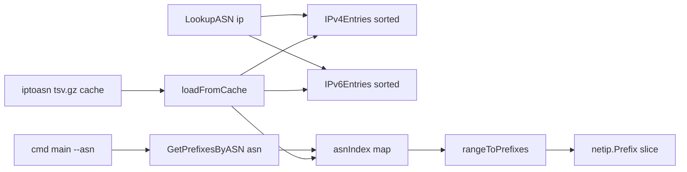

# Requirements

### Overview & Goals

Add a reverse-direction capability to the `asnlookup` library: given an ASN, return every IPv4 and IPv6 CIDR prefix announced by that AS according to the cached iptoasn.com database.

Today the library only supports IP → ASN (`ASNDatabase.LookupASN`). The new `GetPrefixesByASN(int)` closes the loop for callers that need an AS's address footprint (firewall/ACL generation, allow-lists, network inventory).

### Scope

**In scope**
- New method `(*ASNDatabase).GetPrefixesByASN(asn int) []netip.Prefix` in `pkg/asnlookup/`.
- Correct decomposition of the database's start–end IP ranges into a minimal set of exact CIDR prefixes (a single range frequently is *not* a single CIDR).
- An ASN → entries index built during `loadFromCache` so lookups are O(1) + O(prefixes).
- New CLI flag `--asn <number>` in `cmd/main.go`, honouring the existing `--format csv|json` and `--cache-file` flags.
- README API-reference and usage updates.
- Unit tests alongside the existing ones in `pkg/asnlookup/cache_test.go`.

**Out of scope**
- Changing or removing any existing exported symbol, field, signature or behaviour (`ASNEntry`, `ASNEntryInterface`, `ASNDatabase.IPv4Entries` / `IPv6Entries`, `LookupASN`, `GetIPNet`, `NewASNDatabase*`, `DEFAULT_CACHE_FILE`, `ASN_DATABASE_URL`). Downstream projects must keep compiling and behaving identically.
- Changing the cache file format, download URL, or refresh/expiry logic.
- Aggregating/merging prefixes across adjacent entries of the same ASN.
- Lookup by AS name/description or by country.

### User Stories

- As a Go developer, I want `db.GetPrefixesByASN(15169)` so that I can obtain all Google-announced IPv4 and IPv6 CIDRs in one call.
- As an operator, I want `asnlookup --asn 15169 --format json` so that I can pipe an AS's prefix list into tooling without writing Go.
- As a maintainer of a dependent project, I want my current code to compile and run unchanged after upgrading.

### Functional Requirements

1. `GetPrefixesByASN(asn int) []netip.Prefix` returns all prefixes for the ASN, IPv4 prefixes first (ascending), then IPv6 prefixes (ascending).
2. An unknown ASN returns an empty, non-nil-preferred slice (`len == 0`); no error, no panic. Negative or zero ASN behaves the same.
3. Every returned prefix is *masked* and exact: the union of returned prefixes equals exactly the union of the entry ranges for that ASN — no address outside a range is covered, none inside is missed.
4. A range that is not CIDR-aligned (e.g. `1.0.0.0`–`1.0.0.200`) is split into multiple prefixes rather than rounded.
5. Results are stable and deterministic across calls.
6. CLI: `asnlookup --asn 15169` prints one line per prefix in CSV (`<prefix>, AS<asn>, <cc>, "<desc>"`); with `--format json` it prints a single JSON object containing the ASN, country, description and the prefix list.
7. CLI: unknown ASN → message on stderr and non-zero exit, consistent with the existing "No ASN found for IP" path. `--asn` and a positional IP argument together is a usage error.

### Non-Functional Requirements

- Existing `LookupASN` hot path stays untouched; the documented 3M+ lookups/s benchmark must not regress.
- Index construction adds a bounded one-off cost at load (~one map with a few hundred thousand entries); no extra copies of `ASNEntry` data (index stores indices/pointers into the existing slices).
- Library remains dependency-free (standard library only).

# Technical Design

### Current Implementation

`pkg/asnlookup/cache.go` (244 lines) is the whole library:

- `ASNEntry` (L21–27): `Start`, `End net.IP`, `ASN int`, `CountryCode`, `ASDescription`. IPv4 entries are normalised to 4-byte form, IPv6 to 16-byte form in `loadFromCache` (L216–226).
- `ASNEntry.GetIPNet()` (L33–43) + `calculatePrefixLength` (L54–75): derives **one** prefix length from the range size. This is approximate — for a non-aligned or non-power-of-two range it returns a prefix that does not equal the range. It is part of the public API and **must not change**.
- `ASNDatabase` (L84–87): two slices sorted by `Start` (L234–240); `LookupASN` (L93–124) binary-searches them.
- `loadFromCache` (L163–243) parses the gzipped TSV and is the single construction point used by both `NewASNDatabase*` and the tests.
- `cmd/main.go`: flags `--cache-file`, `--timing`, `--format`; requires exactly one positional IP (L38–42) and prints CSV or JSON (L60–85).
- Go 1.25 (`go.mod`), so `net/netip` is available.

### Key Decisions

1. **ASN index built eagerly in `loadFromCache`** (confirmed with user): a new unexported field `asnIndex map[int][]int32` (or `map[int]*asnEntryRefs`) mapping ASN → positions in `IPv4Entries` / `IPv6Entries`. O(1) lookup; no duplication of entry data. Because `ASNDatabase` is an exported struct that callers could in principle construct literally, `GetPrefixesByASN` guards with a `sync.Once`-protected lazy rebuild when `asnIndex == nil`, so a hand-built database still works.
2. **Return `[]netip.Prefix`** (confirmed with user). New code uses `net/netip`; the existing `net.IPNet`-based API is left completely untouched, so no downstream breakage.
3. **New file `pkg/asnlookup/prefixes.go`** rather than growing `cache.go` — keeps the new feature isolated and makes review/diff obvious.
4. **Exact range→CIDR decomposition** implemented from scratch (`rangeToPrefixes`) instead of reusing `calculatePrefixLength`, which is lossy. Classic greedy algorithm: at each step take the largest aligned block starting at `cur` that does not overshoot `end`.
5. **CLI `--asn` is an additive flag**; the existing positional-IP flow and `--timing` flow are unchanged, only a new branch is added before the IP-argument validation.

### Proposed Changes

**`pkg/asnlookup/prefixes.go` (new)**

```go
// rangeToPrefixes converts an inclusive start..end address range into the
// minimal set of exact CIDR prefixes covering it.
func rangeToPrefixes(start, end netip.Addr) []netip.Prefix

// GetPrefixesByASN returns every IPv4 and IPv6 CIDR prefix announced by asn.
// IPv4 prefixes come first (ascending), then IPv6. Empty slice if unknown.
func (db *ASNDatabase) GetPrefixesByASN(asn int) []netip.Prefix

// buildASNIndex populates db.asnIndex from IPv4Entries/IPv6Entries.
func (db *ASNDatabase) buildASNIndex()
```

`rangeToPrefixes` algorithm (both families, driven by `addr.BitLen()`):

```
cur := start
for cur <= end:
    bits  := cur.BitLen()                  // 32 or 128
    plen  := bits - trailingZeroBits(cur)  // largest aligned block at cur
    for plen < bits && lastAddr(cur, plen) > end:
        plen++
    out = append(out, netip.PrefixFrom(cur, plen))
    cur = next(lastAddr(cur, plen))        // stop on overflow
```

Helpers operate on the 4- or 16-byte `As4()`/`As16()` arrays (or `big.Int` for v6) to compute trailing zeros, the broadcast/last address of a prefix, and the successor address with overflow detection.

**`pkg/asnlookup/cache.go` (modified, additive only)**
- Add unexported fields to `ASNDatabase`: `asnIndex map[int]asnEntryRefs` and `indexOnce sync.Once`. Exported fields and all methods keep their exact current shape.
- At the end of `loadFromCache`, after the two `sort.Slice` calls, call `db.buildASNIndex()` (marking `indexOnce` as done) so the index matches the final sorted order.

**`cmd/main.go` (modified, additive only)**
- New flag: `asn := flag.Int("asn", 0, "Look up all prefixes announced by this ASN")`.
- After the `--timing` branch, if `*asn != 0`: reject a simultaneous positional argument, call `db.GetPrefixesByASN(*asn)`, error out if empty, otherwise render CSV or JSON. AS country/description for the header line are taken from the first matching entry (exposed by a tiny helper or by reusing the index).

**`README.md`**
- Add `GetPrefixesByASN` to *API Reference → Methods*, a library usage example, and a CLI section for `--asn`.

### Data Models / Contracts

```go
type asnEntryRefs struct {
    v4 []int32 // indices into ASNDatabase.IPv4Entries
    v6 []int32 // indices into ASNDatabase.IPv6Entries
}

type ASNDatabase struct {
    IPv4Entries []ASNEntry // unchanged, exported
    IPv6Entries []ASNEntry // unchanged, exported

    asnIndex  map[int]asnEntryRefs // new, unexported
    indexOnce sync.Once            // new, unexported
}
```

CLI JSON shape for `--asn`:

```json
{"as":15169,"as_desc":"GOOGLE","country":"us","prefixes":["8.8.8.0/24","2001:4860::/32"]}
```

### File Structure

```
pkg/asnlookup/
  cache.go          (modified: 2 unexported fields + buildASNIndex call)
  prefixes.go       (new: GetPrefixesByASN, buildASNIndex, rangeToPrefixes + helpers)
  prefixes_test.go  (new: decomposition + GetPrefixesByASN tests)
  cache_test.go     (unchanged)
cmd/main.go         (modified: --asn flag + output branch)
README.md           (modified: docs)
```

### Architecture Diagram



### Risks

- **IPv6 128-bit arithmetic**: off-by-one in successor/last-address computation. Mitigated by working on byte arrays with explicit overflow handling and by tests on `::`–`ffff:...:ffff` (full space) and single-address ranges.
- **Overflow at the top of the address space** (`255.255.255.255` / all-ones IPv6): the loop must terminate rather than wrap. Explicit overflow check in the successor helper plus a dedicated test.
- **Malformed DB rows with `End < Start`**: return no prefixes for that entry instead of looping forever.
- **Memory/startup regression**: index stores `int32` indices only; startup cost measured as negligible relative to gzip parsing.
- **Backwards compatibility**: adding unexported fields to `ASNDatabase` breaks only unkeyed composite literals (`ASNDatabase{a, b}`); keyed literals and all current tests are unaffected — verified by running the existing suite unchanged.

# Testing

### Validation Approach

Add `pkg/asnlookup/prefixes_test.go` following the existing table-driven style of `cache_test.go` (gzipped TSV fixtures written to `t.TempDir()`, loaded via `loadFromCache`). Run `go build ./...`, `go vet ./...` and `go test ./pkg/asnlookup/` — the existing tests must pass **unmodified**, proving no regression for dependent projects.

### Key Scenarios

- Aligned IPv4 range `8.8.8.0`–`8.8.8.255` → exactly `[8.8.8.0/24]`.
- Non-aligned IPv4 range `1.0.0.0`–`1.0.0.200` → several prefixes whose union is exactly the range and which are all masked.
- IPv6 range `2001:4860:4860::`–`2001:4860:4860:ffff:ffff:ffff:ffff:ffff` → `[2001:4860:4860::/64]`.
- Mixed fixture where one ASN owns both IPv4 and IPv6 entries → result contains both families, IPv4 first, each family ascending.
- ASN with several non-contiguous IPv4 entries → all are returned, in ascending order.
- Determinism: two consecutive calls return identical slices.

### Edge Cases

- Unknown ASN, ASN `0`, negative ASN → empty result, no panic.
- Single-address range (`Start == End`) → `/32` or `/128`.
- Full IPv4 space `0.0.0.0`–`255.255.255.255` → `[0.0.0.0/0]`; range ending at `255.255.255.255` terminates without overflow wrap.
- Entry with `End < Start` → skipped, no infinite loop.
- `ASNDatabase` built by hand (keyed literal, nil `asnIndex`) → index lazily built, correct result.

### Test Changes

- **Add** `pkg/asnlookup/prefixes_test.go` with `TestRangeToPrefixes`, `TestGetPrefixesByASN_IPv4`, `TestGetPrefixesByASN_IPv6`, `TestGetPrefixesByASN_Mixed`, `TestGetPrefixesByASN_NotFound`, `TestGetPrefixesByASN_LazyIndex`.
- **Do not modify** `pkg/asnlookup/cache_test.go` — keeping it green is the backwards-compatibility check.
- CLI behaviour verified manually with `go run ./cmd --asn 15169` in both formats against a fixture cache file.

# Delivery Steps

### ✓ Step 1: Implement exact range-to-CIDR decomposition
A new `pkg/asnlookup/prefixes.go` can convert any inclusive start–end IP range into the minimal set of exact `netip.Prefix` values, for both IPv4 and IPv6.

- Create `pkg/asnlookup/prefixes.go` with `rangeToPrefixes(start, end netip.Addr) []netip.Prefix`.
- Implement the greedy algorithm: at each position take the largest aligned block that does not overshoot `end`, then advance.
- Add byte-array helpers for trailing-zero count, last address of a prefix, and successor-with-overflow-detection, driven by `Addr.BitLen()` so 32- and 128-bit both work.
- Handle degenerate inputs: `Start == End` → `/32` or `/128`; `End < Start` → empty result; ranges ending at the top of the address space terminate without wrapping.
- Add `pkg/asnlookup/prefixes_test.go` with `TestRangeToPrefixes` covering aligned, non-aligned, single-address, full-IPv4-space and IPv6 cases.

### ✓ Step 2: Add ASN index and GetPrefixesByASN to the library
`db.GetPrefixesByASN(15169)` returns all IPv4 then IPv6 prefixes for that AS, and the existing API is bit-for-bit unchanged.

- Add unexported fields `asnIndex map[int]asnEntryRefs` and `indexOnce sync.Once` to `ASNDatabase` in `pkg/asnlookup/cache.go`; leave `IPv4Entries`, `IPv6Entries`, `LookupASN`, `ASNEntry` and all existing functions untouched.
- Implement `buildASNIndex()` in `prefixes.go`, storing `int32` indices into the two entry slices (`asnEntryRefs{v4, v6 []int32}`).
- Call `buildASNIndex()` at the end of `loadFromCache`, after the two `sort.Slice` calls, and mark `indexOnce` as consumed.
- Implement `GetPrefixesByASN(asn int) []netip.Prefix`: lazily build the index via `indexOnce` when `asnIndex` is nil, look up the refs, convert each entry's `Start`/`End` with `rangeToPrefixes`, emit IPv4 first then IPv6 in ascending order.
- Return an empty slice for unknown / zero / negative ASNs.
- Extend `prefixes_test.go` with IPv4, IPv6, mixed-family, not-found, determinism and hand-built-database (lazy index) tests; confirm `cache_test.go` passes unmodified.

### ✓ Step 3: Expose the feature through the CLI
`asnlookup --asn 15169` prints that AS's prefixes in CSV or JSON while all existing CLI behaviour is preserved.

- Add `asn := flag.Int("asn", 0, ...)` to `cmd/main.go` alongside the existing `--cache-file`, `--timing`, `--format` flags.
- Insert an `--asn` branch after the `--timing` branch and before the positional-IP validation; treat `--asn` plus a positional IP as a usage error.
- Call `db.GetPrefixesByASN(*asn)`; on an empty result print a message to stderr and exit non-zero, mirroring the existing "No ASN found for IP" path.
- CSV output: one line per prefix as `<prefix>, AS<asn>, <cc>, "<desc>"`, reusing the country/description from the first matching entry.
- JSON output: a single object `{"as":...,"as_desc":...,"country":...,"prefixes":[...]}` via `encoding/json`, consistent with the existing JSON branch.
- Verify manually with `go run ./cmd --asn 15169` in both formats and re-check that `asnlookup 8.8.8.8` and `--timing` behave exactly as before.

### ✓ Step 4: Document the new API in the README
README describes `GetPrefixesByASN` and the `--asn` CLI flag with working examples.

- Add a `GetPrefixesByASN` entry under *API Reference → Methods* with its signature and return-type semantics (`[]netip.Prefix`, IPv4 first, empty on unknown ASN).
- Add a library usage example section showing an ASN query and iteration over the returned prefixes.
- Add a CLI section documenting `--asn` with sample CSV and JSON output.
- Note in the Features list that reverse ASN → prefix lookup is supported, without altering the existing documented API.